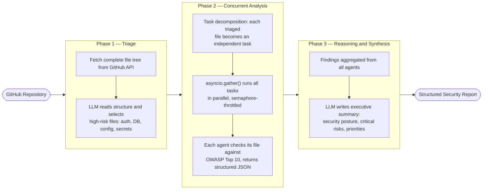

# SecureLens AI — Backend

SecureLens is an AI security agent that connects directly to your GitHub repositories and autonomously hunts for security vulnerabilities in your source code. It does not scan randomly — it reasons about your codebase the same way a security engineer would: reads the file structure, identifies which files carry the most risk, and focuses its analysis where it actually matters.

The agent integrates with GitHub via a **Personal Access Token (PAT)**, giving it read access to any repository you point it at — public or private. The intelligence layer is powered by the **Google Gemini API** (`gemini-2.0-flash`), which is used for three separate reasoning tasks: prioritising which files to investigate, performing deep security analysis of each file's source code against the OWASP Top 10, and maintaining a contextual chat session so you can ask follow-up questions and request patches for specific issues.

Beyond code scanning, SecureLens also performs infrastructure-level security analysis on live URLs — checking headers, SSL configuration, cookie security, and sensitive path exposure — scoring each target out of 100 and generating an AI-written threat narrative explaining how an attacker could chain the findings together.

---

## Documentation

Detailed technical documentation lives in the [`docs/`](./docs/) folder:

| Doc | Description |
|---|---|
| [docs/ai-agent.md](./docs/ai-agent.md) | How the AI agent pipeline works — triage, concurrent analysis, chat context |
| [docs/architecture.md](./docs/architecture.md) | Full system architecture and request flow diagrams |
| [docs/api-reference.md](./docs/api-reference.md) | Every endpoint, request/response shape, and error codes |

---

## How It Works

SecureLens runs a three-phase agentic pipeline when you trigger a code scan:

**Phase 1 — Triage**
The agent fetches the complete file tree from your repository and sends it to Gemini. The model acts as a senior AppSec engineer — it reads the file paths, understands the structure, and selects the files most likely to contain vulnerabilities (auth routes, database queries, API handlers, config files). This is one targeted API call, not a blind scan of everything.

**Phase 2 — Concurrent Analysis**
The agent fetches the source code for each prioritised file from GitHub and sends them all to Gemini simultaneously for deep security analysis. Each file is checked against the OWASP Top 10 — SQL injection, XSS, hardcoded secrets, IDOR, broken access control, misconfigurations, and more. Results come back with severity ratings, affected line numbers, explanations, and specific code fixes.

**Phase 3 — Context-Aware Chat**
After the scan, you can open a live conversation with the agent about what it found. The agent has full context of the scan results — it knows which files were checked, what vulnerabilities were found, and at which lines. Ask it to write a patch, explain an issue in plain English, or prioritise what to fix first.

---

## Agentic Workflow Orchestration

The code scanner is built as a multi-agent reasoning pipeline. Rather than sending the entire repository to an LLM in one shot and hoping for a useful response, it breaks the problem into three discrete stages, each with a focused responsibility. The terms for this kind of design are task decomposition and multi-agent reasoning — the system itself decides what to look at, coordinates parallel work, and synthesises the results.

### The 3-Phase Pipeline



### How each phase works

**Phase 1 — Triage.** The agent fetches the full file tree from GitHub and asks the LLM to do an initial scoping pass — the same judgment call a security engineer makes at the start of a code review. It returns a short list of files most likely to carry real risk: authentication handlers, database queries, config files, anything dealing with secrets. One focused API call replaces the need to blindly download and analyse every file in the repo.

**Phase 2 — Concurrent analysis.** This is where task decomposition happens. Each file from the triage result becomes an independent job. They all run at the same time via `asyncio.gather()`, with a semaphore capping concurrency at 5 to stay within provider rate limits. Every agent sends its file's source code to the LLM with an OWASP Top 10 checklist and gets back structured JSON — severity, issue title, explanation, line number, suggested fix. The response is validated against a Pydantic schema before anything is stored.

**Phase 3 — Synthesis.** Once all agents have reported back, the aggregated findings go to one final LLM call that writes an executive summary of the overall security posture. It looks across all the individual findings and produces something a developer or manager can actually act on.

### Engineering decisions worth noting

The orchestrator never calls the Gemini API directly. All AI calls go through `call_ai()`, a LiteLLM adapter. Swapping the underlying model is a config change, not a code change.

Every agent call uses `json_mode=True` and enforces a fixed output schema. There is no string parsing involved — structured output goes straight into typed Pydantic models. If a call fails, the error is caught and logged and the rest of the pipeline continues.

After the scan finishes, the full result is attached to a persistent chat session. Follow-up questions are answered with that context already loaded — the agent knows which files were scanned, what was found, and where. This is what makes it a stateful, multi-turn reasoning session rather than a one-shot query.

The implementation is in `app/services/code_scanner/orchestrator.py`.

---

## What This Backend Covers

**GitHub Code Scanner**
- Connects to any GitHub repo via Personal Access Token
- AI-driven file triage — the agent decides what to read, not a keyword filter
- Concurrent SAST analysis across prioritised files
- OWASP Top 10 coverage: SQLi, XSS, IDOR, hardcoded secrets, broken auth, misconfigs
- Severity-rated findings with line numbers and suggested fixes
- Persistent scan context for multi-turn AI chat

**Website URL Scanner**
- 30+ checks across 5 security layers (transport, SSL/TLS, headers, cookies, exposure)
- Security score (0–100) and letter grade (A–F)
- AI-enhanced explanations and remediation snippets per finding
- AI-generated Threat Narrative — attack chain reasoning across multiple findings
- Scan history saved per user account

**Platform**
- JWT-based authentication (register, login, token-secured endpoints)
- Rate limiting and SSRF protection on all scan inputs
- Full scan history (list, retrieve, delete)
- Interactive API docs at `/docs`

---

## Security Layers Modeled

SecureLens structures vulnerabilities into 5 logical layers with **30+ security checks**:

| Layer               | Checks | Purpose                                        |
| ------------------- | ------ | ---------------------------------------------- |
| Transport Layer     | 6      | HTTPS, HSTS analysis, mixed content prevention |
| SSL/TLS Layer       | 5      | Certificate expiry, TLS version, chain issues  |
| Server Config Layer | 14     | Security headers, CSP analysis, info disclosure|
| Cookie Security     | 4      | HttpOnly, Secure, SameSite flags               |
| Exposure Layer      | 25+    | Sensitive paths, robots.txt, directory listing  |

---

## Tech Stack

- **Python 3.12+**
- **FastAPI** — async web framework
- **httpx** — async HTTP client (GitHub API + live URL scanning)
- **SQLAlchemy 2.0** — async ORM
- **Pydantic v2** — data validation and settings management
- **google-genai** — Google Gemini AI SDK (code analysis, chat, AI enhancements)
- **python-jose** — JWT authentication
- **passlib + bcrypt** — password hashing
- **SlowAPI** — rate limiting
- **Docker + PostgreSQL** — containerized deployment
- **pytest** — testing

---

## Project Structure

```
securelens-backend/
├── docs/
│   ├── README.md               # Docs index
│   ├── ai-agent.md             # How the AI agent pipeline works
│   ├── architecture.md         # Full system architecture
│   └── api-reference.md        # All endpoints documented
├── app/
│   ├── main.py                 # FastAPI app + middleware + lifespan
│   ├── config.py               # Pydantic settings (.env)
│   ├── database.py             # Async SQLAlchemy engine & session
│   ├── models/
│   │   ├── user.py             # User ORM model
│   │   └── scan.py             # ScanResult ORM model
│   ├── schemas/
│   │   ├── auth.py             # Auth request/response models
│   │   ├── scan.py             # Website scan models
│   │   └── code_scan.py        # Code scan + chat models
│   ├── routers/
│   │   ├── auth.py             # Register, login, me
│   │   ├── health.py           # Health check endpoints
│   │   ├── scan.py             # Website scan endpoint
│   │   ├── history.py          # Scan history endpoints
│   │   └── code_scan.py        # GitHub repo scan + AI chat
│   ├── services/
│   │   ├── ai.py               # Website scanner AI layer (Gemini)
│   │   ├── scoring.py          # Security scoring engine
│   │   ├── scanner/            # Website scanner (5 check layers)
│   │   │   ├── transport.py
│   │   │   ├── ssl_checker.py
│   │   │   ├── headers.py
│   │   │   ├── cookies.py
│   │   │   └── exposure.py
│   │   └── code_scanner/       # GitHub repo AI agent
│   │       ├── orchestrator.py # 3-phase AI pipeline
│   │       └── github_client.py# GitHub API client
│   ├── middleware/
│   │   ├── auth.py             # JWT auth dependencies
│   │   └── rate_limiter.py     # SlowAPI rate limiting
│   └── utils/
│       ├── auth.py             # JWT & password utilities
│       └── validators.py       # URL validation & SSRF prevention
├── tests/
│   ├── conftest.py
│   ├── test_auth.py
│   ├── test_scan.py
│   ├── test_history.py
│   └── ...
├── migrations/                 # Alembic database migrations
├── main.py                     # Root entry point
├── .env.example
├── Dockerfile
├── docker-compose.yml
├── requirements.txt
└── README.md
```

---

## Installation

### Local Development (SQLite)

```bash
git clone https://github.com/Rarebuffalo/securelens-backend
cd securelens-backend
python -m venv venv
source venv/bin/activate
pip install -r requirements.txt
cp .env.example .env
uvicorn app.main:app --reload
```

The database is auto-created as `securelens.db` on first run.

### Docker (with PostgreSQL)

```bash
cp .env.example .env
docker compose up --build
```

---

## Configuration

Copy `.env.example` to `.env` and set your values:

| Variable              | Default                                    | Description                       |
| --------------------- | ------------------------------------------ | --------------------------------- |
| `APP_NAME`            | SecureLens AI                              | Application name                  |
| `APP_VERSION`         | 1.0.0                                      | Application version               |
| `DEBUG`               | true                                       | Enable debug mode & docs          |
| `HOST`                | 0.0.0.0                                    | Server host                       |
| `PORT`                | 8000                                       | Server port                       |
| `CORS_ORIGINS`        | http://localhost:3000,http://localhost:5173 | Allowed CORS origins              |
| `RATE_LIMIT`          | 30/minute                                  | API rate limit                    |
| `SCAN_TIMEOUT`        | 5                                          | HTTP request timeout (seconds)    |
| `PATH_CHECK_TIMEOUT`  | 3                                          | Sensitive path check timeout (s)  |
| `DATABASE_URL`        | sqlite+aiosqlite:///./securelens.db        | Database connection string        |
| `JWT_SECRET`          | (change in production!)                    | Secret key for JWT signing        |
| `JWT_ALGORITHM`       | HS256                                      | JWT signing algorithm             |
| `JWT_EXPIRY_MINUTES`  | 1440                                       | Token expiry (default: 24h)       |
| `GEMINI_API_KEY`      | (required for AI features)                 | Google Gemini API key             |

Get a free Gemini API key at [aistudio.google.com/apikey](https://aistudio.google.com/apikey). Without it, the app still works but all AI-powered features (code scanning, AI chat, AI enhancements) are disabled.

---

## API Endpoints

### Health

| Method | Endpoint   | Description      |
| ------ | ---------- | ---------------- |
| GET    | `/`        | Welcome message  |
| GET    | `/health`  | App status       |

### Authentication

| Method | Endpoint          | Description               | Auth |
| ------ | ----------------- | ------------------------- | ---- |
| POST   | `/auth/register`  | Create account + get token| No   |
| POST   | `/auth/login`     | Login + get token         | No   |
| GET    | `/auth/me`        | Get current user info     | Yes  |

### Code Scanner (AI Agent)

| Method | Endpoint                | Description                                      | Auth     |
| ------ | ----------------------- | ------------------------------------------------ | -------- |
| POST   | `/code-scan/analyze`    | Run AI agent against a GitHub repo               | No       |
| POST   | `/code-scan/chat`       | Chat with AI about a specific scan's results     | No       |
| GET    | `/code-scan/models`     | List available Gemini models for your API key    | No       |

### Website Scanner

| Method | Endpoint         | Description                          | Auth     |
| ------ | ---------------- | ------------------------------------ | -------- |
| POST   | `/scan`          | Scan a URL (saves if authenticated)  | Optional |

### Scan History

| Method | Endpoint          | Description               | Auth |
| ------ | ----------------- | ------------------------- | ---- |
| GET    | `/scans`          | List your scan history    | Yes  |
| GET    | `/scans/{id}`     | Get scan details by ID    | Yes  |
| DELETE | `/scans/{id}`     | Delete a scan             | Yes  |

### Example Usage

**Scan a GitHub Repo (AI Agent):**
```bash
curl -X POST http://127.0.0.1:8000/code-scan/analyze \
  -H "Content-Type: application/json" \
  -d '{"repo_url": "https://github.com/user/repo", "github_token": "ghp_xxx", "branch": "main"}'
```

**Chat with the scan:**
```bash
curl -X POST http://127.0.0.1:8000/code-scan/chat \
  -H "Content-Type: application/json" \
  -d '{"scan_id": "<scan_id from above>", "message": "Write a patch for the highest severity issue"}'
```

**Scan a URL:**
```bash
curl -X POST http://127.0.0.1:8000/scan \
  -H "Content-Type: application/json" \
  -H "Authorization: Bearer YOUR_TOKEN" \
  -d '{"url": "https://example.com"}'
```

**Register:**
```bash
curl -X POST http://127.0.0.1:8000/auth/register \
  -H "Content-Type: application/json" \
  -d '{"email": "user@example.com", "username": "myuser", "password": "securepass123"}'
```

---

## Running Tests

```bash
pytest tests/ -v
```

Tests use an in-memory SQLite database — no external DB needed.

---

## Future Roadmap

- **Multi-LLM support** — swap out the AI provider via config. Planned support for OpenAI, Anthropic Claude, Mistral, and self-hosted models (Ollama), so you are not locked into any single API key or vendor
- **CI/CD integration** — run SecureLens as part of your deployment pipeline (GitHub Actions, GitLab CI, etc.) to automatically scan every pull request or deployment for new vulnerabilities before they hit production
- Persistent chat history (store code scan results in PostgreSQL)
- PDF report generation for code scan results
- DNS security checks (SPF, DKIM, DMARC)
- Technology fingerprinting
- JavaScript library CVE detection via package.json analysis

---

## License

This project is open-source and available under the **MIT License**.

Happy Hacking! 🛡️
