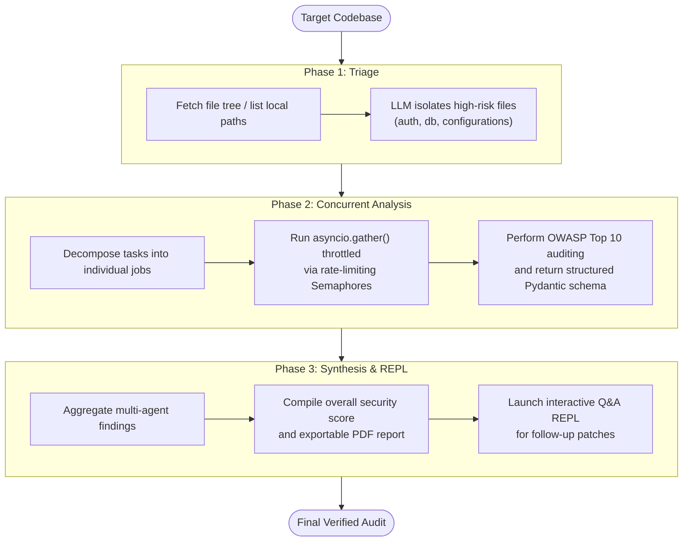

<!-- SPDX-FileCopyrightText: 2026 Ai-chan-0411 <aoikabu12@gmail.com> -->
<!-- SPDX-FileCopyrightText: 2026 Apoorv Garg <apoorvgarg.21@gmail.com> -->
<!-- SPDX-FileCopyrightText: 2026 Aryan Iyappan <aryaniyappan2006@gmail.com> -->
<!-- SPDX-FileCopyrightText: 2026 Subramania Raja <dhanpraja231@gmail.com> -->
<!-- SPDX-FileCopyrightText: 2026 Hari Srinivasan <harisrini21@gmail.com> -->
<!-- SPDX-FileCopyrightText: 2026 Hemalatha Madeswaran <hemalathamadeswaran@gmail.com> -->
<!-- SPDX-FileCopyrightText: 2026 Kaushik Kumar <kaushikrjpm10@gmail.com> -->
<!-- SPDX-FileCopyrightText: 2026 Lokesh Selvam <lokeshselvam7025@gmail.com> -->
<!-- SPDX-FileCopyrightText: 2026 Naraen Rammoorthi <naraen13@gmail.com> -->
<!-- SPDX-FileCopyrightText: 2026 Shaan Narendran <shaannaren06@gmail.com> -->
<!-- SPDX-FileCopyrightText: 2026 Shreem Seth <shreemseth26@gmail.com> -->
<!-- SPDX-FileCopyrightText: 2026 DoomsCoder <vedantkakade05@gmail.com> -->
<!-- SPDX-FileCopyrightText: 2026 Vishnu Muthiah <vishnu.muthiah04@gmail.com> -->
<!-- SPDX-License-Identifier: MIT -->

<pre align="center">
 ██████╗███████╗ ██████╗██╗   ██╗██████╗ ███████╗██╗     ███████╗███╗   ██╗███████╗
██╔════╝██╔════╝██╔════╝██║   ██║██╔══██╗██╔════╝██║     ██╔════╝████╗  ██║██╔════╝
╚█████╗ █████╗  ██║     ██║   ██║██████╔╝█████╗  ██║     █████╗  ██╔██╗ ██║███████╗
 ╚═══██╗██╔══╝  ██║     ██║   ██║██╔══██╗██╔══╝  ██║     ██╔══╝  ██║╚██╗██║╚════██║
██████╔╝███████╗╚██████╗╚██████╔╝██║  ██║███████╗███████╗███████╗██║ ╚████║███████║
╚══════╝╚══════╝ ╚═════╝ ╚═════╝ ╚═╝  ╚═╝╚══════╝╚══════╝╚══════╝╚═╝  ╚═══╝╚══════╝
</pre>

<p align="center">
  <b>An AI-native AppSec agent and local security auditor. Autonomously triage and scan codebases against the OWASP Top 10, probe live web infrastructure, generate threat narratives, and engage in interactive triage chat sessions directly from your terminal or CI/CD pipelines.</b>
</p>

<p align="center">
  <a href="LICENSE"></a>
  
  
  
  
</p>

---

## Table of Contents

- [Core Capabilities](#core-capabilities)
- [How It Works (Multi-Agent Pipeline)](#how-it-works-multi-agent-pipeline)
- [Quick Start](#quick-start)
  - [1. Deploy Backend Server](#1-deploy-backend-server)
  - [2. Install Local CLI](#2-install-local-cli)
  - [3. Configure CLI](#3-configure-cli)
- [CLI Command Guide](#cli-command-guide)
  - [Scan Codebases](#scan-codebases)
  - [Audit Web Infrastructure](#audit-web-infrastructure)
  - [Interactive Triage REPL](#interactive-triage-repl)
- [Supported Providers](#supported-providers)
- [API Endpoints Summary](#api-endpoints-summary)
- [Architecture & Tech Stack](#architecture--tech-stack)
- [Roadmap](#roadmap)
- [License](#license)

---

## Core Capabilities

SecureLens provides a dual-component security environment to verify application safety at the code level and infrastructure level:

* **Autonomous Code Auditor:** Rather than scanning blindly, SecureLens acts like an AppSec engineer. It triages repositories to locate high-risk files (auth handlers, DB layers, configs), performs concurrent OWASP Top 10 analysis, and synthesizes findings into actionable remediation guidance.
* **Web Infrastructure Prober:** Run deep probes on live URLs checking 30+ parameters across SSL/TLS strength, Cookie flags, transport policies, and exposure vectors. It computes an overall security score and uses AI to write a threat chain narrative showing how attackers might combine weaknesses.
* **Interactive CLI Companion:** Work locally with custom ignore filters, offline signature checks, local PDF report compiles, and direct synchronization of findings back to the server console.

---

## How It Works (Multi-Agent Pipeline)

SecureLens runs a decomposed three-phase orchestrator to ensure highly targeted, context-aware analysis:


```mermaid
flowchart TD
    A([Target Codebase]) --> B[Phase 1: Triage]
    
    subgraph B ["Phase 1: Triage"]
        B1["Fetch file tree / list local paths"]
        B2["LLM isolates high-risk files\n(auth, db, configurations)"]
        B1 --> B2
    end
    
    B --> C[Phase 2: Concurrent Analysis]
    
    subgraph C ["Phase 2: Concurrent Analysis"]
        C1["Decompose tasks into individual jobs"]
        C2["Run asyncio.gather() throttled\nvia rate-limiting Semaphores"]
        C3["Perform OWASP Top 10 auditing\nand return structured Pydantic schema"]
        C1 --> C2 --> C3
    end
    
    C --> D[Phase 3: Synthesis & REPL]
    
    subgraph D ["Phase 3: Synthesis & REPL"]
        D1["Aggregate multi-agent findings"]
        D2["Compile overall security score\nand exportable PDF report"]
        D3["Launch interactive Q&A REPL\nfor follow-up patches"]
        D1 --> D2 --> D3
    end
    
    D --> E([Final Verified Audit])
```

---

## Quick Start

SecureLens consists of a **central backend server** (managing scans, JWT authentication, and historical tracking) and an **interactive CLI tool**.

### 1. Deploy Backend Server

#### Standard Docker Compose (Recommended)
Launch the server along with PostgreSQL instantly:
```bash
cp .env.example .env
docker compose up --build
```

#### Manual Development Setup (SQLite)
```bash
git clone https://github.com/Rarebuffalo/securelens-backend.git
cd securelens-backend
python -m venv venv
source venv/bin/activate
pip install -r requirements.txt
cp .env.example .env
uvicorn app.main:app --reload
```
*The dev server defaults to `http://127.0.0.1:8000`. Database is automatically initialized.*

### 2. Install Local CLI

Choose one of the following installation methods based on your platform and preferences:

#### Method A: One-Line Global Installation (Cross-Platform)
Recommended for general use. Installs the CLI globally on Windows, macOS, or Linux directly from the repository without needing to clone it manually:
```bash
pip install git+https://github.com/Rarebuffalo/securelens-backend.git#subdirectory=cli
```
*(Or use `pipx install git+...` to automatically isolate the tool in its own environment).*

#### Method B: Local Source Installation (Development)
If you have cloned this repository locally:
```bash
# On Linux/macOS
chmod +x cli/install.sh
./cli/install.sh
source venv/bin/activate

# On Windows or manual setup
pip install -e cli/
```

### 3. Configure CLI

Initiate configuration with the interactive wizard to set up API keys and point to your server:
```bash
securelens configure
```
This saves credentials, preferred models, and settings to your local profile at `~/.securelens/config.yaml`.

---

## CLI Command Guide

### Scan Codebases

Analyze local codebases. SecureLens automatically triages your file tree, ignoring builds/artifacts, runs the selected model, and drops you into a chat.

```bash
securelens scan .                              # Scan current folder
securelens scan ./project                      # Scan specific directory
securelens scan . --model gpt-4o               # Specify model override
securelens scan . --no-ai                      # Run lightning-fast offline regex pattern scan
securelens scan . --sync                       # Upload scan results automatically to backend
securelens scan . --ci --fail-on high          # CI pipeline mode: exits with non-zero on High vulnerabilities
```

### Audit Web Infrastructure

Probe a live target website for transport layer security, configurations, and header exposure.

```bash
securelens web https://example.com             # Scan target URL
securelens web https://my-app.com --no-ai      # Raw scanner check without AI summary
securelens web https://my-app.com --output md  # Save results to markdown file
```

### Unified Stateful Interactive CLI Shell

SecureLens supports a unified interactive shell prompt. Running the main executable without any subcommands drops you directly into this shell:

```bash
securelens
```

This starts the stateful console session:

```text
Welcome to SecureLens AI Interactive Shell
Type /help for a list of available commands or /exit to quit.

securelens > /scan .
... Runs scan and populates active session ...

securelens > /score
Score: 0/100 Grade: F

securelens > What Cassandra connection issues were identified?
... Ask follow-up Q&A questions directly to the AI about the active scan ...
```

#### Supported Interactive Commands
* `/scan <path>` — Scan a local codebase (e.g. `/scan .`)
* `/scan-web <url>` — Scan a live website (e.g. `/scan-web https://example.com`)
* `/configure` — Launch the setup wizard to configure API keys or base URLs
* `/files` — List files selected for AI triage in the active scan
* `/score` — Print the security score and grade (A-F) of the active scan
* `/issues` or `/issues <severity>` — Display a summary of all issues or filter by severity
* `/export <pdf/json/markdown>` — Generate and save report files for the active scan
* `/model <name>` — Switch AI models dynamically
* `/clear` — Clear the terminal screen
* `/help` — Display interactive commands helper
* `/exit` — Terminate the interactive session

---

## Supported Providers

SecureLens leverages [LiteLLM](https://github.com/BerriAI/litellm) under the hood. You can configure any model matching your credential flags:

| Provider | Model Identifier | Config Required |
|---|---|---|
| **Google Gemini (Default)** | `gemini/gemini-2.0-flash` | `GEMINI_API_KEY` |
| **OpenAI** | `gpt-4o`, `gpt-4o-mini` | `OPENAI_API_KEY` |
| **Anthropic** | `claude-3-5-sonnet-latest`, `claude-3-5-haiku-20241022` | `ANTHROPIC_API_KEY` |
| **Ollama** | `ollama/llama3.1` | Run local Ollama server |

---

## API Endpoints Summary

Interact with the server via the standard REST endpoints or use the interactive documentation at `/docs`:

| Area | Method | Route | Description | Auth |
|---|---|---|---|---|
| **System** | `GET` | `/health` | Verify server status | No |
| **Auth** | `POST` | `/auth/register` | Register new profile | No |
| **Auth** | `POST` | `/auth/login` | Retrieve access token | No |
| **Code Scan** | `POST` | `/code-scan/analyze` | Trigger Git repository triage & audit | Yes |
| **Code Scan** | `POST` | `/code-scan/sync` | Sync local scanner results to database | Yes |
| **Code Scan** | `POST` | `/code-scan/chat` | Continue chat discussion about code scan | Yes |
| **Web Scan** | `POST` | `/scan` | Audit a URL's network security | Optional |
| **History** | `GET` | `/scans` | List historical scan records | Yes |
| **History** | `DELETE` | `/scans/{id}` | Purge a scan record from DB | Yes |

---

## Architecture & Tech Stack

SecureLens uses a modern, lightweight async tech stack:

* **Backend Engine:** Python 3.12+, FastAPI, SQLAlchemy 2.0 (Async DB support), Pydantic v2.
* **Database Layer:** PostgreSQL (Docker production deployment) / SQLite (Aiosqlite for local development).
* **AI Adapter:** LiteLLM provider client with structured JSON parsing constraints.
* **CLI Utility:** Click (CLI parser), Rich (terminal style/color engine), PyYAML.
* **Local Exporters:** FPDF2 (PDF generation).

---

## Roadmap

* [x] **Local Offline Scanner** — Execute regex-based pattern scans on offline environments.
* [x] **Terminal PDF Generation** — Native local PDF output via CLI.
* [x] **Server Synchronisation** — Push local CLI findings to central PostgreSQL dashboards.
* [ ] **CI/CD Integration Packages** — Dedicated GitHub Actions and GitLab Runner wrappers.
* [ ] **Dependency Audit (`securelens audit`)** — Check packages against the OSV DB.
* [ ] **Automated Patches (Git MRs)** — Generate Git PRs directly from CLI fixes.

---

## License

This repository is licensed under the **MIT License**. See [LICENSE](LICENSE) for details.

---

*Happy Hacking! Keep your codebases secure.*
