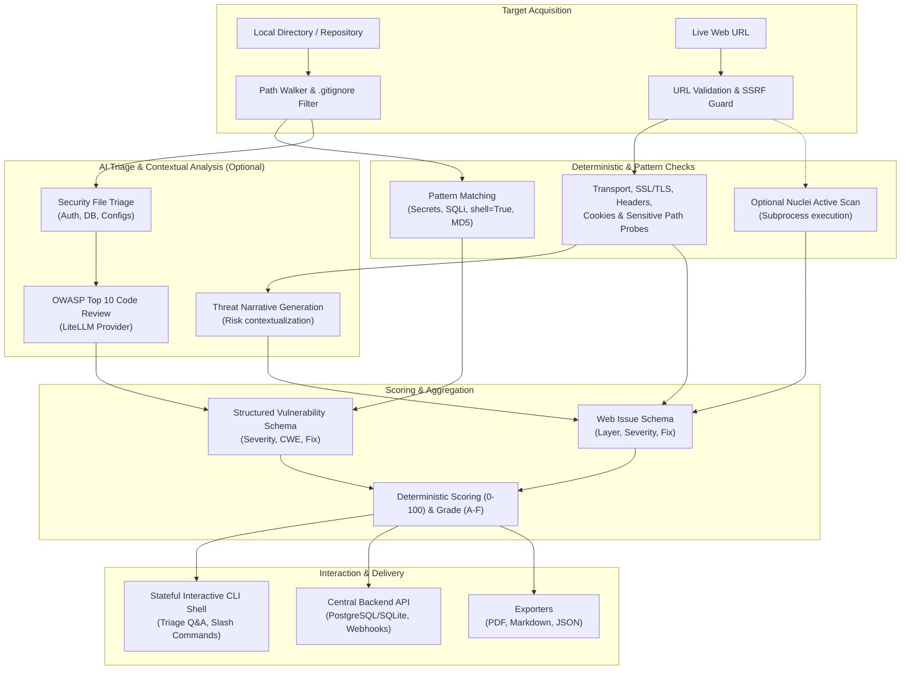

<!-- SPDX-FileCopyrightText: 2026 Ai-chan-0411 <aoikabu12@gmail.com> -->
<!-- SPDX-FileCopyrightText: 2026 Apoorv Garg <apoorvgarg.21@gmail.com> -->
<!-- SPDX-FileCopyrightText: 2026 Aryan Iyappan <aryaniyappan2006@gmail.com> -->
<!-- SPDX-FileCopyrightText: 2026 Subramania Raja <dhanpraja231@gmail.com> -->
<!-- SPDX-FileCopyrightText: 2026 Hari Srinivasan <harisrini21@gmail.com> -->
<!-- SPDX-FileCopyrightText: 2026 Hemalatha Madeswaran <hemalathamadeswaran@gmail.com> -->
<!-- SPDX-FileCopyrightText: 2026 Kaushik Kumar <kaushikrjpm10@gmail.com> -->
<!-- SPDX-FileCopyrightText: 2026 Lokesh Selvam <lokeshselvam7025@gmail.com> -->
<!-- SPDX-FileCopyrightText: 2026 Naraen Rammoorthi <naraen13@gmail.com> -->
<!-- SPDX-FileCopyrightText: 2026 Shaan Narendran <shaannaren06@gmail.com> -->
<!-- SPDX-FileCopyrightText: 2026 Shreem Seth <shreemseth26@gmail.com> -->
<!-- SPDX-FileCopyrightText: 2026 DoomsCoder <vedantkakade05@gmail.com> -->
<!-- SPDX-FileCopyrightText: 2026 Vishnu Muthiah <vishnu.muthiah04@gmail.com> -->
<!-- SPDX-License-Identifier: MIT -->

<pre align="center">
 ██████╗███████╗ ██████╗██╗   ██╗██████╗ ███████╗██╗     ███████╗███╗   ██╗███████╗
██╔════╝██╔════╝██╔════╝██║   ██║██╔══██╗██╔════╝██║     ██╔════╝████╗  ██║██╔════╝
╚█████╗ █████╗  ██║     ██║   ██║██████╔╝█████╗  ██║     █████╗  ██╔██╗ ██║███████╗
 ╚═══██╗██╔══╝  ██║     ██║   ██║██╔══██╗██╔══╝  ██║     ██╔══╝  ██║╚██╗██║╚════██║
██████╔╝███████╗╚██████╗╚██████╔╝██║  ██║███████╗███████╗███████╗██║ ╚████║███████║
╚══════╝╚══════╝ ╚═════╝ ╚═════╝ ╚═╝  ╚═╝╚══════╝╚══════╝╚══════╝╚═╝  ╚═══╝╚══════╝
</pre>

<p align="center">
  <b>AI-assisted AppSec analysis platform and local security investigation layer.</b>
</p>

<p align="center">
  <a href="LICENSE"></a>
  
  
  
  
  
</p>

---

## Overview

**SecureLens** is an AI-assisted AppSec analysis platform that sits above security scanners and turns raw code and web-security findings into prioritized, explainable security investigations and remediation guidance.

Security detection tools identify potential vulnerabilities, but teams often struggle with the subsequent analysis: understanding the context, triaging severity against application architecture, explaining the impact to developers, and prioritizing remediation steps.

SecureLens addresses this post-detection workflow:

```text
Raw Findings / Target
         ↓
  Context Analysis
         ↓
Security Triage & Risk Filtering
         ↓
Deterministic Scoring & Prioritization
         ↓
Explainable Remediation Guidance
         ↓
Interactive Investigation & Structured Reports (CLI / API)
```

### What SecureLens Does NOT Replace

SecureLens is **not** positioned as a replacement for specialized security scanners such as:
- **Static Analysis / SAST:** Semgrep, SonarQube, CodeQL
- **Secret Scanners:** Gitleaks, Trufflehog
- **Container / SCA Scanners:** Trivy, Snyk, OSV-Scanner
- **Dynamic Scanners / DAST:** Nuclei, OWASP ZAP

Instead, SecureLens provides an orchestration, triage, scoring, explanation, and interactive investigation layer designed to make security findings easier to analyze, prioritize, and remediate.

---

## Table of Contents

- [Why SecureLens?](#why-securelens)
- [What SecureLens Does](#what-securelens-does)
  - [1. Codebase Security Analysis](#1-codebase-security-analysis)
  - [2. Web Security Configuration & Exposure Analysis](#2-web-security-configuration--exposure-analysis)
  - [3. Security Triage & Explanation](#3-security-triage--explanation)
  - [4. Interactive CLI Shell](#4-interactive-cli-shell)
  - [5. Central Backend & REST API](#5-central-backend--rest-api)
  - [6. Reports & Export](#6-reports--export)
  - [7. Integrations & Providers](#7-integrations--providers)
- [How It Works](#how-it-works)
- [Example Workflow](#example-workflow)
- [Installation](#installation)
  - [1. Local CLI Installation](#1-local-cli-installation)
  - [2. Backend Server Deployment](#2-backend-server-deployment)
  - [3. Configuration](#3-configuration)
- [CLI Usage](#cli-usage)
- [API Reference](#api-reference)
- [Architecture](#architecture)
- [Security Model](#security-model)
- [Current Status](#current-status)
- [Limitations](#limitations)
- [Roadmap](#roadmap)
- [Development & Testing](#development--testing)
- [License](#license)

---

## Why SecureLens?

Traditional security workflows frequently face the following challenges:
- **Disjointed tooling:** Code analysis, transport inspection, and header configurations are evaluated across separate utilities with disparate output formats.
- **Context gaps:** Raw scanner alerts lack project-specific explanations of *why* an issue represents a vulnerability and *how* to resolve it in context.
- **High cognitive load:** Developers and auditors must manually sift through unstructured findings to decide what requires immediate action.

SecureLens is designed to make security findings easier to investigate and act on by providing:
- A unified local workflow for source code repositories and live web targets.
- Deterministic risk scoring with transparent deductions.
- An explanation layer powered by LLMs to contextualize issues.
- Stateful terminal chat sessions to query and inspect active scan findings.
- Local PDF, Markdown, and JSON report generation.

---

## What SecureLens Does

### 1. Codebase Security Analysis
SecureLens analyzes local source repositories through a structured pipeline:
* **Repository Discovery:** Traverses the filesystem while honoring `.gitignore` rules and configurable ignore patterns (`node_modules`, `dist`, `.git`, binaries).
* **Pattern-Based Security Checks:** Deterministic regex pattern matching for hardcoded secrets (AWS keys, API tokens, private keys), insecure process execution (`shell=True`), SQL string formatting, weak cryptography (MD5/SHA1 for passwords), and insecure configurations.
* **Security-Sensitive File Triage:** Automatically identifies and prioritizes security-critical files (auth handlers, DB connectors, config files, route handlers).
* **AI-Assisted Analysis:** When an AI provider is configured, files are analyzed against the OWASP Top 10 to extract structured findings, contextual explanations, and actionable remediation steps.
* **Offline Deterministic Mode (`--no-ai`):** Operates completely offline without external network or LLM dependencies using deterministic pattern rules.
* **Scoring & Letter Grades:** Calculates an objective security score (0–100) and letter grade (A–F) based on finding severities (Critical: -20, High: -12, Medium: -5, Low: -2).

### 2. Web Security Configuration & Exposure Analysis
SecureLens performs live inspection of web targets to evaluate security configurations and exposed attack surfaces:
* **URL & Network Validation:** Validates URL schemes and blocks private/loopback IP addresses (SSRF mitigation).
* **TLS / SSL Inspection:** Verifies certificate validity, detects expired or expiring certificates (within 30 days), self-signed certificates, and weak protocol versions.
* **Transport Security:** Verifies HTTPS enforcement, HSTS (`Strict-Transport-Security`) headers, `max-age` requirements, and `includeSubDomains`/`preload` directives.
* **Security Headers Inspection:** Checks for `Content-Security-Policy`, `X-Frame-Options`, `X-Content-Type-Options`, `Referrer-Policy`, and `Permissions-Policy`, while flagging information disclosure in `Server` or `X-Powered-By` headers.
* **Cookie Flags:** Evaluates `HttpOnly`, `Secure`, and `SameSite` flags on cookies.
* **Sensitive Path Exposure Probing:** Probes for exposed administrative panels, configuration files (`.env`, `config.json`), source control directories (`.git/HEAD`), and diagnostic pages.
* **Active Nuclei Integration:** Optionally invokes `nuclei` in a sandboxed subprocess (`shell=False`) for active vulnerability template matching if installed.

### 3. Security Triage & Explanation
AI in SecureLens functions as an **analysis and explanation layer**; it does not replace deterministic security checks.

When findings are identified:
* Findings are normalized into structured schemas (file, line number, severity, issue title, contextual explanation, suggested fix, and CWE reference where available).
* The AI generates threat chain narratives demonstrating how distinct findings might be combined by an attacker.
* Developers can ask open-ended questions in the interactive terminal shell to drill down into specific findings or request targeted code fixes.

### 4. Interactive CLI Shell
SecureLens includes a stateful interactive REPL (`securelens`):
* **Stateful Context:** Keeps the active scan in memory so subsequent commands and chat queries operate on the latest scan findings.
* **Command Suite:**
  * `/scan <path>` — Scan a local directory.
  * `/scan-web <url>` — Scan a web target.
  * `/score` — Display the overall score and letter grade badge.
  * `/issues [severity]` — View finding summaries or filter by severity (`critical`, `high`, `medium`, `low`).
  * `/files` — List files analyzed during triage.
  * `/export <markdown|json|pdf>` — Export the active report.
  * `/model <name>` — Switch AI models dynamically at runtime.
  * `/configure` — Open the interactive configuration wizard.
  * `/help` — Display command reference.
  * `/clear` — Clear the console.
  * `/exit` — Exit the shell.
* **Autocompletion & Path Suggestion:** Real-time path autocompletion and command history via `prompt_toolkit`.

### 5. Central Backend & REST API
A FastAPI central server manages persistence, synchronization, and historical tracking:
* **JWT Authentication:** User registration, password hashing (`bcrypt`), login, and user profile management.
* **Programmatic API Keys:** Create, list, and revoke API keys for automation.
* **Scan Synchronization:** Push local CLI scan findings to the central database via `POST /code-scan/sync`.
* **Scan History & Retrieval:** Paginated scan history with strict user-level data isolation.
* **Automated Webhook Dispatch:** Signs and dispatches HMAC-SHA256 webhooks to registered endpoints upon scan completion.
* **Background Scheduling:** Scheduled recurring scans powered by AsyncIO APScheduler.

### 6. Reports & Export
Export findings into standardized formats directly from the CLI or API:
* **JSON:** Complete machine-readable output including metadata, score, files scanned, and detailed vulnerability objects.
* **Markdown:** Human-readable reports categorized by severity or layer with remediation recommendations.
* **PDF:** Locally compiled PDF security reports generated via FPDF2 with styled scorecards, severity tables, and remediation notes.

### 7. Integrations & Providers

| Category | Component / Provider | Status in SecureLens | Notes |
|---|---|---|---|
| **Security Tool** | **Nuclei** | Supported & Verified | Invoked via safe subprocess (`asyncio.create_subprocess_exec`) when the binary is present; skips gracefully if absent. |
| **AI Provider** | **Google Gemini** | Supported & Default | `gemini/gemini-2.0-flash`, `gemini/gemini-1.5-pro` (via LiteLLM). |
| **AI Provider** | **OpenAI** | Supported | `gpt-4o`, `gpt-4o-mini` (via LiteLLM). |
| **AI Provider** | **Anthropic** | Supported | `claude-3-5-sonnet-latest`, `claude-3-5-haiku-20241022` (via LiteLLM). |
| **AI Provider** | **Ollama** | Supported | `ollama/llama3.1` (local LLM inference without external API keys). |

---

## How It Works

SecureLens employs a deterministic-first analysis pipeline augmented by AI triage and explanation:


```mermaid
flowchart TD
    subgraph Input ["Target Acquisition"]
        A1["Local Directory / Repository"] --> B1["Path Walker & .gitignore Filter"]
        A2["Live Web URL"] --> B2["URL Validation & SSRF Guard"]
    end

    subgraph Detection ["Deterministic & Pattern Checks"]
        B1 --> C1["Pattern Matching\n(Secrets, SQLi, shell=True, MD5)"]
        B2 --> C2["Transport, SSL/TLS, Headers,\nCookies & Sensitive Path Probes"]
        B2 -.-> C3["Optional Nuclei Active Scan\n(Subprocess execution)"]
    end

    subgraph AI_Layer ["AI Triage & Contextual Analysis (Optional)"]
        B1 --> D1["Security File Triage\n(Auth, DB, Configs)"]
        D1 --> D2["OWASP Top 10 Code Review\n(LiteLLM Provider)"]
        C2 --> D3["Threat Narrative Generation\n(Risk contextualization)"]
    end

    subgraph Synthesis ["Scoring & Aggregation"]
        C1 & D2 --> E1["Structured Vulnerability Schema\n(Severity, CWE, Fix)"]
        C2 & C3 & D3 --> E2["Web Issue Schema\n(Layer, Severity, Fix)"]
        E1 --> F["Deterministic Scoring (0-100) & Grade (A-F)"]
        E2 --> F
    end

    subgraph Presentation ["Interaction & Delivery"]
        F --> G1["Stateful Interactive CLI Shell\n(Triage Q&A, Slash Commands)"]
        F --> G2["Central Backend API\n(PostgreSQL/SQLite, Webhooks)"]
        F --> G3["Exporters\n(PDF, Markdown, JSON)"]
    end
```

---

## Example Workflow

### 1. Developer Runs Local Code Scan
```bash
securelens scan ./my-app --output json
```

### 2. Output Generated
```json
{
  "scan_type": "code",
  "target": "/home/user/my-app",
  "timestamp": "2026-08-30T06:00:00.000000",
  "score": 68,
  "grade": "D",
  "files_scanned": ["auth.py", "database.py", "util.py"],
  "total_issues": 2,
  "vulnerabilities": [
    {
      "file": "auth.py",
      "line": 5,
      "severity": "Critical",
      "issue": "Hardcoded AWS Access Key ID",
      "explanation": "AWS credentials hardcoded in source code can lead to complete infrastructure compromise.",
      "fix": "Revoke the exposed key in the AWS Console and load credentials via environment variables or AWS IAM roles."
    },
    {
      "file": "util.py",
      "line": 6,
      "severity": "High",
      "issue": "Insecure Command Execution (shell=True)",
      "explanation": "Invoking the system shell with uncontrolled user input allows arbitrary command injection.",
      "fix": "Set shell=False and pass command arguments as an array."
    }
  ],
  "ai_summary": "Scan identified 1 Critical credential exposure in auth.py and 1 High command injection vector in util.py."
}
```

### 3. Interactive Triage in the Terminal Shell
```text
securelens [my-app] > /issues critical

  1 issue(s):
  [1] Critical  Hardcoded AWS Access Key ID  auth.py:5

securelens [my-app] > How should I migrate auth.py to use environment variables?

  [AI Assistant provides targeted refactoring guidance for auth.py...]

securelens [my-app] > /export pdf
  ✓ PDF report saved: securelens-report-20260830_060000.pdf
```

---

## Installation

SecureLens consists of a **local CLI** and an **optional backend server**.

### 1. Local CLI Installation

#### Method A: Global Installation via pip / pipx
```bash
pip install git+https://github.com/Rarebuffalo/securelens-backend.git#subdirectory=cli
# Or using pipx:
pipx install git+https://github.com/Rarebuffalo/securelens-backend.git#subdirectory=cli
```

#### Method B: Local Development Installation
```bash
git clone https://github.com/Rarebuffalo/securelens-backend.git
cd securelens-backend
python -m venv venv
source venv/bin/activate
pip install -e cli/
```

### 2. Backend Server Deployment

#### Local Development (SQLite)
```bash
source venv/bin/activate
pip install -r requirements.txt
cp .env.example .env
uvicorn app.main:app --reload --port 8000
```
*Server runs at `http://127.0.0.1:8000`. Interactive documentation available at `/docs` when `DEBUG=True`.*

#### Production Deployment (Docker Compose with PostgreSQL)
```bash
cp .env.example .env
docker compose up --build
```

### 3. Configuration
Launch the interactive configuration wizard to configure AI providers and backend sync:
```bash
securelens configure
```
Configuration is stored in `~/.securelens/config.yaml` with environment variable overrides:
- `GEMINI_API_KEY` — Google Gemini API key (default model: `gemini/gemini-2.0-flash`).
- `OPENAI_API_KEY` — OpenAI API key.
- `ANTHROPIC_API_KEY` — Anthropic API key.
- `SECURELENS_BACKEND_URL` — Central backend URL (default: `http://localhost:8000`).
- `SECURELENS_TOKEN` — Optional JWT Bearer token for authenticated scan sync.

---

## CLI Usage

```bash
# Launch unified interactive shell
securelens

# Scan local directory with AI analysis
securelens scan .

# Fast offline scan (pattern-based rules only, no AI required)
securelens scan ./project --no-ai

# Scan and synchronize findings to the backend server
securelens scan ./project --sync

# CI pipeline mode (exits with code 1 on high/critical findings)
securelens scan ./project --ci --fail-on high

# Web security configuration scan
securelens web https://example.com

# Web scan with Markdown export
securelens web https://example.com --output markdown
```

---

## API Reference

The backend exposes the following REST endpoints:

| Area | Method | Route | Description | Auth Required |
|---|---|---|---|---|
| **System** | `GET` | `/health` | Healthcheck endpoint | No |
| **Auth** | `POST` | `/auth/register` | Register new user account | No |
| **Auth** | `POST` | `/auth/login` | Authenticate and obtain JWT token | No |
| **Auth** | `GET` | `/auth/me` | Retrieve authenticated user profile | Yes (Bearer) |
| **API Keys** | `POST` | `/auth/api-keys` | Generate new API key | Yes (Bearer) |
| **API Keys** | `GET` | `/auth/api-keys` | List active API keys | Yes (Bearer) |
| **API Keys** | `DELETE` | `/auth/api-keys/{id}` | Revoke an API key | Yes (Bearer) |
| **Web Scan** | `POST` | `/scan` | Audit a URL's network/web security | Optional |
| **Web Scan History** | `GET` | `/scans` | List user web scans | Yes (Bearer) |
| **Web Scan History** | `GET` | `/scans/{id}` | Retrieve specific web scan record | Yes (Bearer) |
| **Web Scan History** | `DELETE` | `/scans/{id}` | Delete a web scan record | Yes (Bearer) |
| **Reports** | `GET` | `/scans/{id}/report/pdf` | Generate PDF report for web scan | Yes (Bearer) |
| **Code Scan** | `POST` | `/code-scan/analyze` | Trigger Git repository triage & audit | Yes (Bearer) |
| **Code Scan** | `POST` | `/code-scan/sync` | Sync local scanner results to backend DB | Yes (Bearer) |
| **Code Scan** | `POST` | `/code-scan/chat` | Follow-up chat regarding code scan | Yes (Bearer) |
| **Code Scan** | `GET` | `/code-scan/models` | List available LLM models for code scanning | Yes (Bearer) |
| **Code Scan History** | `GET` | `/code-scan/history` | List user code scan history | Yes (Bearer) |
| **Code Scan History** | `GET` | `/code-scan/{id}` | Retrieve specific code scan detail | Yes (Bearer) |
| **Code Scan History** | `DELETE` | `/code-scan/{id}` | Delete a code scan record | Yes (Bearer) |
| **Scheduled Scans** | `POST` | `/scheduled-scans` | Schedule recurring web scan | Yes (Bearer) |
| **Scheduled Scans** | `GET` | `/scheduled-scans` | List scheduled scans | Yes (Bearer) |
| **Scheduled Scans** | `DELETE` | `/scheduled-scans/{id}` | Cancel scheduled scan | Yes (Bearer) |
| **Webhooks** | `POST` | `/webhooks` | Register endpoint for scan notifications | Yes (Bearer) |
| **Webhooks** | `GET` | `/webhooks` | List registered webhooks | Yes (Bearer) |
| **Webhooks** | `DELETE` | `/webhooks/{id}` | Delete registered webhook | Yes (Bearer) |

---

## Architecture

```text
┌─────────────────────────────────────────────────────────────┐
│                    SecureLens CLI                           │
│  ┌───────────────────────┐   ┌───────────────────────────┐  │
│  │ Local Code Scanner    │   │ Live Web Scanner          │  │
│  │ (Regex + AI Triage)   │   │ (TLS, Headers, Paths)     │  │
│  └───────────────────────┘   └───────────────────────────┘  │
│  ┌───────────────────────────────────────────────────────┐  │
│  │ Stateful Interactive REPL (prompt_toolkit + Rich)     │  │
│  │ Reports & PDF Exporter (FPDF2)                        │  │
│  └───────────────────────────────────────────────────────┘  │
└──────────────────────────────┬──────────────────────────────┘
                               │ HTTP / JSON API (Optional Sync)
                               ▼
┌─────────────────────────────────────────────────────────────┐
│                   FastAPI Central Backend                   │
│  ┌────────────────────────┐   ┌──────────────────────────┐  │
│  │ Auth & API Key Engine  │   │ Code Scan & Sync Router  │  │
│  │ (bcrypt + JWT)         │   │                          │  │
│  └────────────────────────┘   └──────────────────────────┘  │
│  ┌────────────────────────┐   ┌──────────────────────────┐  │
│  │ Web Scanner & SSRF     │   │ APScheduler              │  │
│  │ Validation             │   │ (Recurring Scans)        │  │
│  └────────────────────────┘   └──────────────────────────┘  │
│  ┌────────────────────────┐   ┌──────────────────────────┐  │
│  │ HMAC Webhook Engine    │   │ Nuclei Subprocess Runner │  │
│  │ (Async Dispatcher)     │   │ (create_subprocess_exec) │  │
│  └────────────────────────┘   └──────────────────────────┘  │
└──────────────────────────────┬──────────────────────────────┘
                               │ Async SQLAlchemy 2.0
                               ▼
┌─────────────────────────────────────────────────────────────┐
│                      Database Layer                         │
│  PostgreSQL (Production) / SQLite + aiosqlite (Development) │
└─────────────────────────────────────────────────────────────┘
```

---

## Security Model

SecureLens incorporates security controls across its components:
* **Authentication & Credentials:** Passwords hashed with `bcrypt`. Stateless JWT tokens with expiration validation. API keys hashed for database storage.
* **User Isolation:** All historical scans, scheduled jobs, and webhooks enforce strict tenant-level isolation in SQL queries.
* **SSRF Prevention:** `validate_url` resolves DNS hostnames and verifies target IPs against RFC 1918, RFC 3927, loopback, and local multicast blocks before initiating network connections.
* **Safe Subprocess Execution:** External tool execution (Nuclei) uses `asyncio.create_subprocess_exec` with arguments passed as structured lists (`shell=False`) and enforced timeouts.
* **Abuse Protection:** Rate limiting middleware (SlowAPI) protects public endpoints against brute-force and request floods.
* **Local Privacy:** Code scanning in offline mode (`--no-ai`) executes purely on local hardware without sending source code or findings to any external network endpoint.

---

## Current Status

As of **August 2026**, the core functionality of SecureLens has undergone end-to-end audit and stabilization:

* **Automated Test Suite:** `108 passed / 108 total` (100% pass rate).
* **CLI Core Workflows:** Verified (Offline pattern scanning, AI triage, interactive shell, JSON/Markdown/PDF exports).
* **Web Scanning Pipeline:** Verified (SSL/TLS, security headers, cookie flags, sensitive path probes).
* **Backend API & Data Layer:** Verified (Authentication, sync, history, user isolation, webhooks, scheduling).
* **External Scanners:** Verified Nuclei subprocess execution and graceful fallback.

---

## Live Demo & Hosted API

SecureLens is designed as a **CLI-first tool** that works 100% locally and offline without requiring a server. For multi-device scan synchronization, history persistence, and team integrations, a demonstration API instance is hosted on Render with Neon PostgreSQL:

* **Live Health Endpoint:** `https://securelens-backend.onrender.com/health`
* **Interactive API Docs:** `https://securelens-backend.onrender.com/docs`

To sync local scans with the demo backend:
```bash
securelens scan . --sync --api-url https://securelens-backend.onrender.com
```

> [!NOTE]
> Free demonstration instances on Render automatically spin down after inactivity. Initial requests after idling may take a few seconds to warm up.

---

## Limitations

To maintain engineering integrity, the following boundaries of SecureLens must be noted:
* **Not a Complete DAST / Pentest Replacement:** Web scanning analyzes configurations, transport parameters, headers, and known sensitive paths; it is not a replacement for deep manual penetration testing or full-scale DAST tools.
* **Not a Replacement for Specialized SAST / Secret Scanners:** The offline scanner checks common vulnerability patterns; comprehensive coverage across complex polyglot codebases benefits from combining SecureLens with dedicated tools (e.g., Semgrep, Gitleaks).
* **AI Output Requires Human Verification:** AI explanations and triage suggestions are advisory and should be reviewed by developers or security engineers before deploying code modifications.
* **Model Provider Dependencies:** AI-assisted analysis and interactive Q&A require internet connectivity and valid API credentials for the chosen LLM provider (unless using local Ollama).
* **Roadmap Features:** Items in the roadmap (CI/CD action packages, dependency SCA auditing, auto PR generation) are not yet implemented.

---

## Roadmap

The following capabilities represent future development goals:

- [ ] **CI/CD Integration Packages:** Native GitHub Actions and GitLab CI reusable workflow actions.
- [ ] **Dependency & SCA Auditing:** Software Composition Analysis integrated against the OSV database.
- [ ] **Automated Remediation Pull Requests:** Automated Git branch and PR creation directly from confirmed CLI fixes.
- [ ] **Custom Rule Engine:** Support for custom user-defined YAML rule templates for local scanning.

---

## Development & Testing

### Running the Test Suite
The project uses `pytest` with `pytest-asyncio` for unit and integration testing.

```bash
# Run all automated tests (108 tests)
venv/bin/pytest -v

# Run tests without log output noise
venv/bin/pytest -v -p no:logging

# Run specific test modules
venv/bin/pytest tests/test_auth.py -v
venv/bin/pytest tests/test_code_scan.py -v
venv/bin/pytest tests/test_webhook.py -v
venv/bin/pytest tests/test_cli_commands.py -v
```

---

## License

This project is licensed under the **MIT License**. See [LICENSE](LICENSE) for details.
